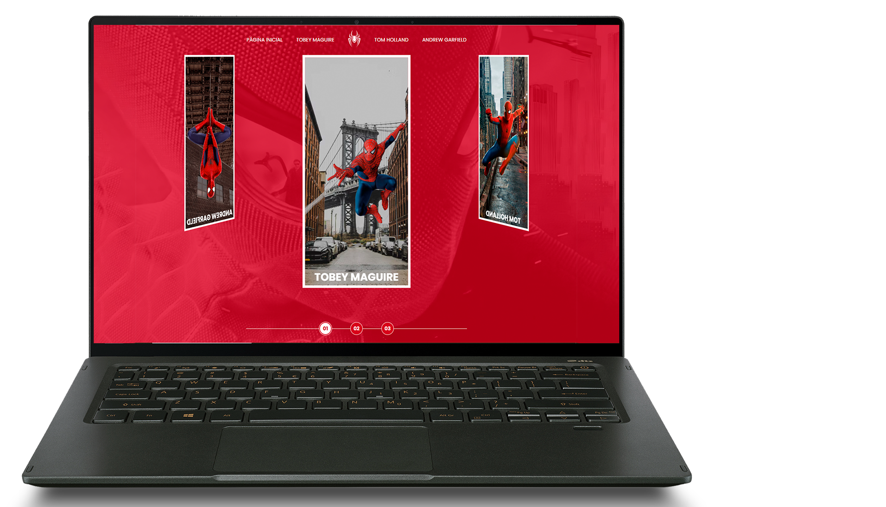
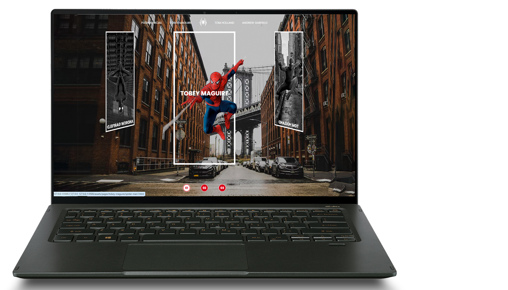
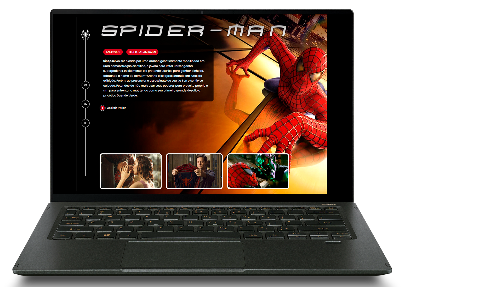
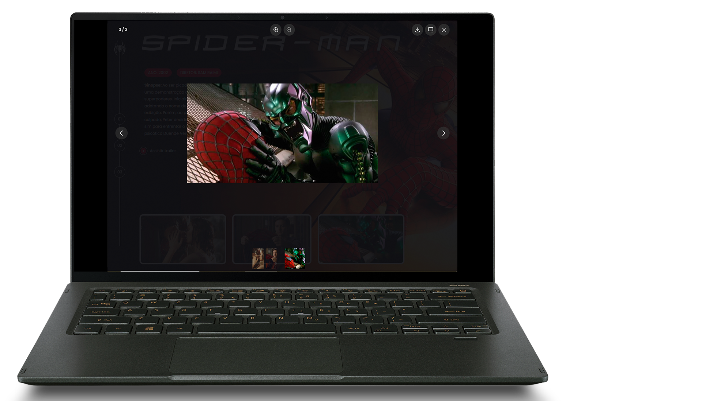

# <a href="https://filipeboneberge.github.io/spider-man-multiverso/"> :link: Spider-Man Multiverso  </a>

<h2>:warning:ESSE PROJETO FOI UM DESAFIO QUE DESENVOLVI ATRAVÉS DO BOOTCAMP FRONT-END DIO COM GRUPO RI HAPPY :warning:  </h2>
 

<h3>Esse site do Spider-Man Multiverso traz diversos conceitos/aprendizados como:  </h3>
<ul>
  <li>Animações</li>
  <li>Posicionamento </li>
  <li>Manipulação JS </li>
  <li>Perspectiva 3D </li>
</ul>

 

   
 

<h2>:computer:Tecnologias Utilizadas</h2>

